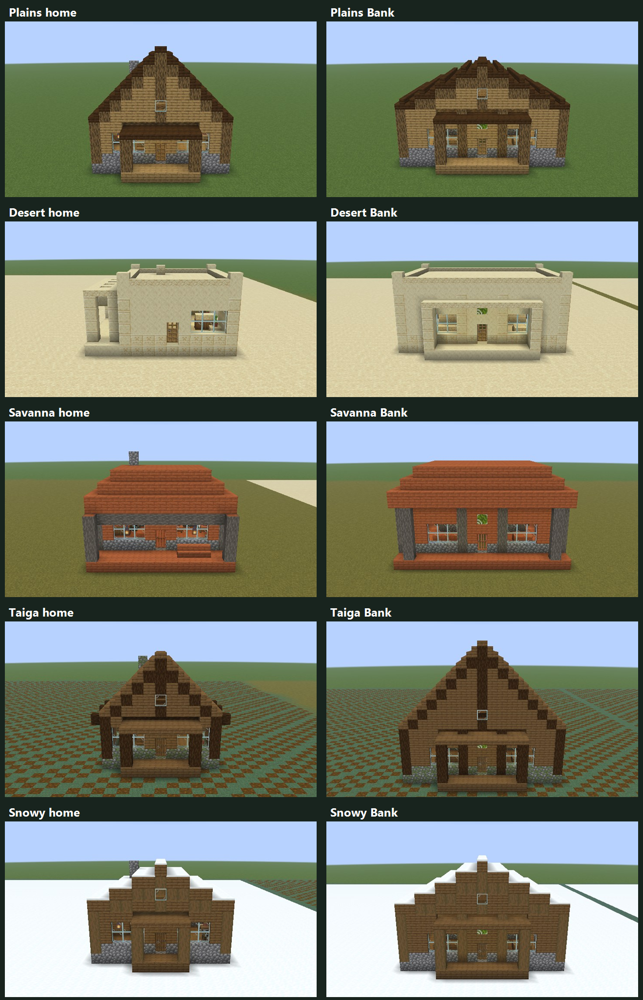
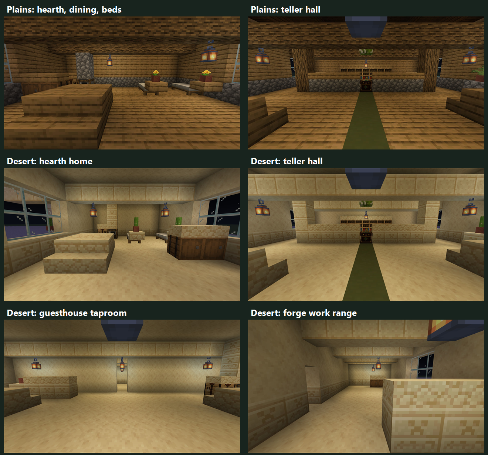

# Biome architecture — first review preview

Historical revision-one screenshots. The [current revision-three preview](BIOME_ARCHITECTURE_PREVIEW_REVISION_3.md)
retains existing TES Plains architecture with oak roofs, adds regional craft, and fixes floating
furnishings. [Revision two](BIOME_ARCHITECTURE_PREVIEW_REVISION_2.md) is preserved for comparison.

Branch: `codex/biome-architecture-preview`. Based on beta.57, commit `26b049b`.
**Not merged into main. Not enabled in normal village generation.**

This is the small approval checkpoint before redesigning the complete catalog. It includes
the Plains family and Bank interiors/exteriors, as requested. These are real, placed Minecraft
prototypes, not concept renders or finished replacements for every TES design.

## Exterior direction



The contact sheet crops only excess sky/ground and labels the native screenshots. The links
below open full, uncropped frames. Each biome has a different silhouette and arrival treatment:

| Family | Direction being reviewed |
| --- | --- |
| Plains | Oak framing, cobblestone footing, dark-oak roofs and porches. The Bank has a broader, lower public-hall roof than the home. |
| Desert | Pale sandstone, flat terraces, restrained parapets and shaded side courts. No orange acacia roof recoloring. |
| Savanna | Acacia, shallow stepped hip roofs and broad verandas rather than steep northern gables. |
| Taiga | Narrower spruce/log homes, steep timber gables and mossy stone footings. |
| Snowy | Compact spruce cabins, lower stepped snow-bearing roofs and protected porches. |

## Interior direction



Homes group the hearth/kitchen, dining space, reachable storage and two real beds into readable
areas. Banks have a central customer aisle, a framed teller line with an actual Exchange Desk,
side access into the staff area, and a ledger/cabinet wall. Inns separate their taproom and
kitchen from a guest corridor with four beds. The desert smithy separates its indoor work
range from a shaded forge court with furnace, anvil, grindstone and quenching station.

The Bank's functional zoning is intentionally consistent between families; exterior geometry
and regional materials change. This first pass does **not** claim five completely unrelated Bank
floor plans or final artistic polish. The samples establish a direction to accept or revise.
Additional room asymmetry, facade refinements and profession-specific details remain subject
to review before the full catalog is expanded.

## All 13 samples

Each row has three daytime exterior frames and two nighttime, player-eye-height interior frames.
The actual Minecraft camera position, orientation, FOV and screenshot hashes were validated.
JPEGs retain the full 1920×1080 viewport; compression is the only full-frame image change.

| # | Prototype | Exterior | Entrance view | Reverse view | Actual vanilla reference |
| --- | --- | --- | --- | --- | --- |
| 1 | Plains hearth home | [View](previews/biome-architecture-2026-10-02/001-mod.jpg) | [View](previews/biome-architecture-2026-10-02/001-interior-entry.jpg) | [View](previews/biome-architecture-2026-10-02/001-interior-reverse.jpg) | [Pair](previews/biome-architecture-2026-10-02/001-pair.jpg) |
| 2 | Plains Bank | [View](previews/biome-architecture-2026-10-02/002-mod.jpg) | [View](previews/biome-architecture-2026-10-02/002-interior-entry.jpg) | [View](previews/biome-architecture-2026-10-02/002-interior-reverse.jpg) | [Pair](previews/biome-architecture-2026-10-02/002-pair.jpg) |
| 3 | Plains guesthouse | [View](previews/biome-architecture-2026-10-02/003-mod.jpg) | [View](previews/biome-architecture-2026-10-02/003-interior-entry.jpg) | [View](previews/biome-architecture-2026-10-02/003-interior-reverse.jpg) | [Pair](previews/biome-architecture-2026-10-02/003-pair.jpg) |
| 4 | Desert hearth home | [View](previews/biome-architecture-2026-10-02/004-mod.jpg) | [View](previews/biome-architecture-2026-10-02/004-interior-entry.jpg) | [View](previews/biome-architecture-2026-10-02/004-interior-reverse.jpg) | [Pair](previews/biome-architecture-2026-10-02/004-pair.jpg) |
| 5 | Desert Bank | [View](previews/biome-architecture-2026-10-02/005-mod.jpg) | [View](previews/biome-architecture-2026-10-02/005-interior-entry.jpg) | [View](previews/biome-architecture-2026-10-02/005-interior-reverse.jpg) | [Pair](previews/biome-architecture-2026-10-02/005-pair.jpg) |
| 6 | Desert guesthouse | [View](previews/biome-architecture-2026-10-02/006-mod.jpg) | [View](previews/biome-architecture-2026-10-02/006-interior-entry.jpg) | [View](previews/biome-architecture-2026-10-02/006-interior-reverse.jpg) | [Pair](previews/biome-architecture-2026-10-02/006-pair.jpg) |
| 7 | Desert forge court | [View](previews/biome-architecture-2026-10-02/007-mod.jpg) | [View](previews/biome-architecture-2026-10-02/007-interior-entry.jpg) | [View](previews/biome-architecture-2026-10-02/007-interior-reverse.jpg) | [Pair](previews/biome-architecture-2026-10-02/007-pair.jpg) |
| 8 | Savanna hearth home | [View](previews/biome-architecture-2026-10-02/008-mod.jpg) | [View](previews/biome-architecture-2026-10-02/008-interior-entry.jpg) | [View](previews/biome-architecture-2026-10-02/008-interior-reverse.jpg) | [Pair](previews/biome-architecture-2026-10-02/008-pair.jpg) |
| 9 | Savanna Bank | [View](previews/biome-architecture-2026-10-02/009-mod.jpg) | [View](previews/biome-architecture-2026-10-02/009-interior-entry.jpg) | [View](previews/biome-architecture-2026-10-02/009-interior-reverse.jpg) | [Pair](previews/biome-architecture-2026-10-02/009-pair.jpg) |
| 10 | Taiga hearth home | [View](previews/biome-architecture-2026-10-02/010-mod.jpg) | [View](previews/biome-architecture-2026-10-02/010-interior-entry.jpg) | [View](previews/biome-architecture-2026-10-02/010-interior-reverse.jpg) | [Pair](previews/biome-architecture-2026-10-02/010-pair.jpg) |
| 11 | Taiga Bank | [View](previews/biome-architecture-2026-10-02/011-mod.jpg) | [View](previews/biome-architecture-2026-10-02/011-interior-entry.jpg) | [View](previews/biome-architecture-2026-10-02/011-interior-reverse.jpg) | [Pair](previews/biome-architecture-2026-10-02/011-pair.jpg) |
| 12 | Snowy hearth home | [View](previews/biome-architecture-2026-10-02/012-mod.jpg) | [View](previews/biome-architecture-2026-10-02/012-interior-entry.jpg) | [View](previews/biome-architecture-2026-10-02/012-interior-reverse.jpg) | [Pair](previews/biome-architecture-2026-10-02/012-pair.jpg) |
| 13 | Snowy Bank | [View](previews/biome-architecture-2026-10-02/013-mod.jpg) | [View](previews/biome-architecture-2026-10-02/013-interior-entry.jpg) | [View](previews/biome-architecture-2026-10-02/013-interior-reverse.jpg) | [Pair](previews/biome-architecture-2026-10-02/013-pair.jpg) |

These are curated comparisons, **not natural village generation**. Minecraft has no financial
Bank or TES-style inn; its reference is the nearest available profession/house analogue,
identified in the in-world `comparison-index.md`. No numerical review counter resets or
external art-review scores are implied.

## Safety and validation

- Production stays at 52 revision-11 authored designs and Bank version 12. No current building,
  saved construction project, economy record, player world, funding rule or recipe is replaced.
- Prototype placement requires the two existing gallery opt-ins, the additional architecture
  preview opt-in, and the exact **NEW Superflat** save `TES_Biome_Architecture_Preview`.
- The gallery refuses occupied plots, inventories, fluids, interrupted placement and stale
  layout signatures. Its signature includes every prototype block/state, not just dimensions.
- All 13 samples passed deterministic native plan admission on Fabric and the NeoForge loader
  test. Checks cover envelopes, reachable furniture approaches, physical bed counts and
  nonzero block-light coverage on declared traversable floors. This is not an assertion that
  every floor reaches the separate comfort threshold of seven.
- Live Fabric placement checked fragile attachments and collision-free interior camera poses;
  the completed batch contains 65 screenshots. [Capture evidence](previews/biome-architecture-2026-10-02/capture-evidence.csv)
  connects each exported image to its original PNG checksum and actual camera pose.
- The common regression suite passed (108 Java regression entry points, plus loader/version
  and wrapper checks). Both comparison and preview isolation regressions were rerun after
  the final gallery guard changes. NeoForge rendering itself was not captured.
- The full Fabric build passed, including the production authored-building checks and the
  native preview verification. The filtered NeoForge preview loader test also passed.
- Handbook accuracy review: long-form building chapters, English building-catalog/growth
  prose and compact project/growth pages remain accurate because these prototypes are not
  gameplay designs. No recipe or handbook entry advertises the preview as a shipped feature.

The gallery validates a flat presentation, not every hillside foundation or production
construction lifecycle. Production admission, biome-family freezing, banker navigation,
construction ordering, terrain/entrance integration, costs/capacity parity and save migration
must be covered before any approved family is rolled into gameplay.

## Open the local preview

For this review, a separate disposable profile was prepared at `build/biome-preview-client-03`.
That profile requires revision-one code (`9041f4f`). Current code intentionally refuses its stale
layout signature; use the fresh profile described in the revision-two notes instead.
It contains no copied player/chunk data. From the repository root:

```powershell
./scripts/open-village-comparison.ps1 -ArchitecturePreview -GameDirectory ./build/biome-preview-client-03
```

Use `/emerald comparison visit 1` through `13`, then fly/walk around and enter the building.
To capture again, add `-Capture -StopAfterCapture`. It creates a new screenshot batch.

For another checkout, first create a **new** Superflat/Creative save with the exact preview
name in a dedicated profile; the helper refuses to invent, copy, delete or overwrite a world.
The existing [comparison gallery guide](VILLAGE_COMPARISON_GALLERY.md) explains profile setup.
Pass `-ArchitecturePreview` to select the prototype world rather than the production comparison.
If the prototypes are subsequently changed, create another empty profile; do not erase or
repaint a stale gallery. The isolated preview gate is:

```powershell
cd fabric
./gradlew.bat verifyBiomeArchitecturePreview
# NeoForge requires its real test bootstrap:
cd ../neoforge
./gradlew.bat test --tests '*BiomeArchitecturePreviewLoaderTest'
```

## Next approval checkpoint

Review the silhouette/palette for each family and the Bank/home functional interiors first.
Accept or revise individual families before expanding to remaining roles. Full-catalog rollout
and merging into `main` are separate steps and require explicit user approval. Keeping the
current release instead requires no save rollback: the prototypes never entered gameplay.
