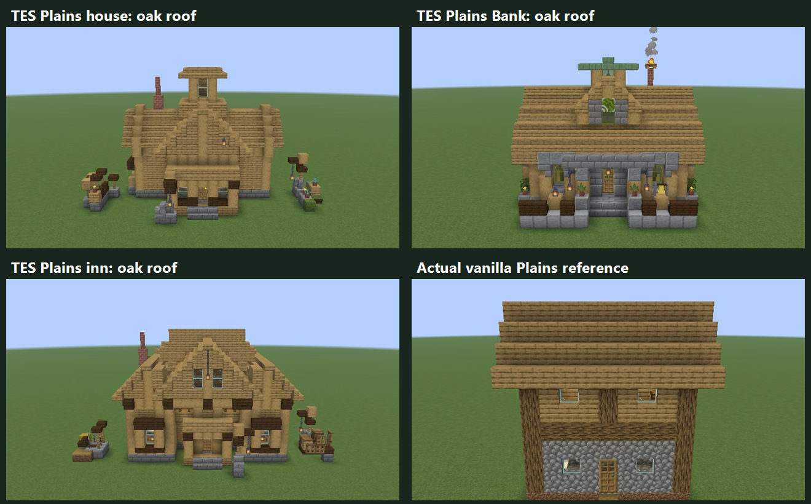
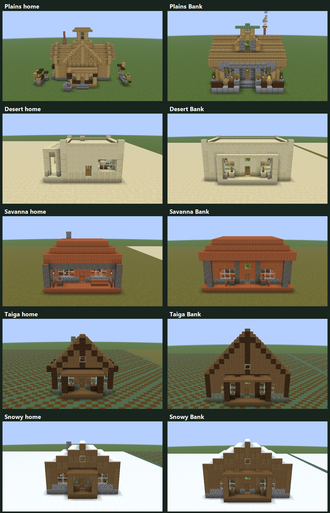
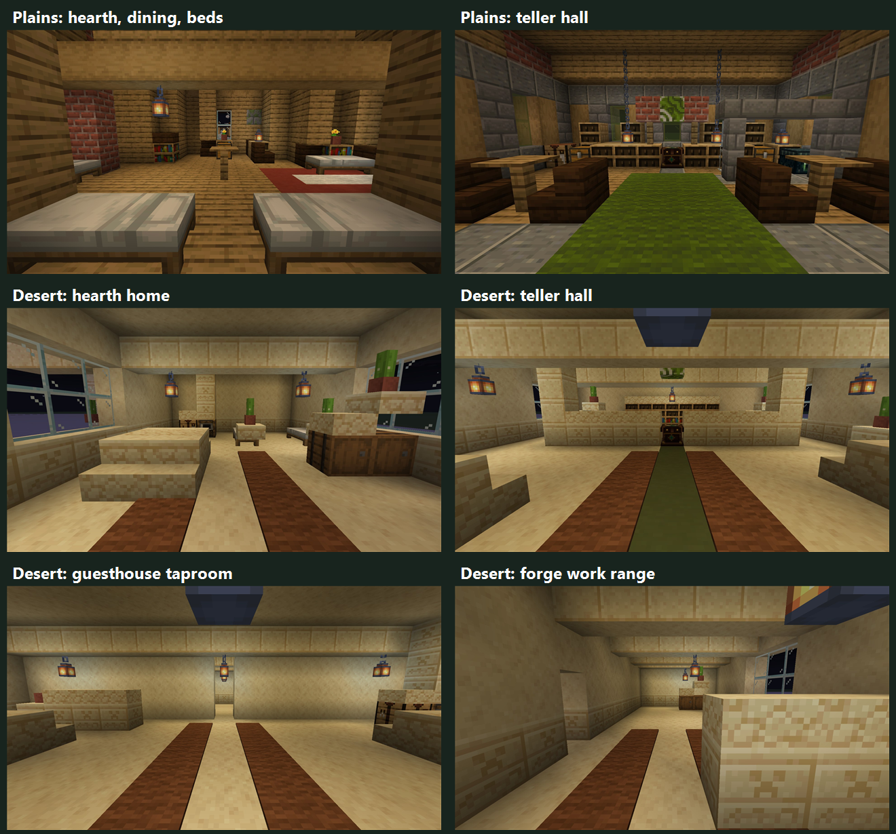

# Biome architecture preview — revision 2

Historical review checkpoint. See [revision 3](BIOME_ARCHITECTURE_PREVIEW_REVISION_3.md) for
the latest regional detailing and corrections to the half-block furniture gaps found here.
Its captured world requires revision-two code (`df1a770`); current code intentionally refuses
that stale layout signature instead of replacing any placed work.

Branch: `codex/biome-architecture-preview`. **Main and normal village generation are unchanged.**
This is another small review checkpoint, not permission to roll the designs into gameplay.

## Plains: keep TES architecture, test vanilla oak roofs

The simplified revision-one Plains designs have been replaced by copies of the **current**
TES cross-gabled house (`house_cross_01@11`), balcony inn (`inn_gallery_01@11`), and standalone
Bank (version 12). These are not the old, obsolete persisted revisions: “legacy” here means the
existing architecture you already use, not a save migration.

Only dark-oak roof materials are changed to their oak equivalents in the preview copies.
Authored house/inn replacements are restricted to the native roof phase. The Bank changes its
upper dark-wood roof/canopies; its low dark forecourt accents remain. Stair facing, shape and
half, slab type and waterlogging are preserved. Footprints, walls, interiors, doors, fixtures,
landscaping and bed counts are retained. A native comparison checks every source cell.

This uses actual vanilla oak textures, not a yellow recolor. Your shader/resource pack may
make that oak look more golden than these unshaded development-client screenshots.





## Added detail without cluttering the route

The other four families keep their revision-one architectural forms. Their new accents use
existing porches, cabinets and floors rather than scattered decorative blocks:

- Short biome-matched side rails leave the central entrance open. Desert uses sandstone walls,
  Savanna acacia fences, and northern styles spruce fences.
- Porch lanterns hang from actual canopy members. Existing interior pendants remain supported.
- Cabinet plants sit on full-height supported shelves. Porch-end plants use supported pots;
  cactus suits Desert, ferns suit northern styles, and flowers suit Savanna.
- Small coordinated carpet runners flank the circulation spine. Rugs are placed only on empty,
  supported floor cells, and the admission check treats carpet as traversable, not a full block.

Plains keeps its current TES landscaping, lanterns and furnishings intact for the focused
roof-color test. The current catalog already supplies its detailed yards and window dressing.
This revision does not redesign every interior or populate every building with identical props.



## Actual in-game views

Every row links full, uncropped 1920×1080 native screenshots. The contact sheets crop exterior
sky/ground only, label frames, and preserve aspect ratio. JPEG compression is the only
full-frame image alteration. Previous images remain in [revision 1](BIOME_ARCHITECTURE_PREVIEW.md).

| # | Sample | Exterior | Inside | Reverse | Vanilla comparison |
| --- | --- | --- | --- | --- | --- |
| 1 | Existing Plains cross-gabled house, oak roof | [View](previews/biome-architecture-2026-10-02-r2/001-mod.jpg) | [View](previews/biome-architecture-2026-10-02-r2/001-interior-entry.jpg) | [View](previews/biome-architecture-2026-10-02-r2/001-interior-reverse.jpg) | [Pair](previews/biome-architecture-2026-10-02-r2/001-pair.jpg) |
| 2 | Existing Plains Bank, oak roof | [View](previews/biome-architecture-2026-10-02-r2/002-mod.jpg) | [View](previews/biome-architecture-2026-10-02-r2/002-interior-entry.jpg) | [View](previews/biome-architecture-2026-10-02-r2/002-interior-reverse.jpg) | [Pair](previews/biome-architecture-2026-10-02-r2/002-pair.jpg) |
| 3 | Existing Plains balcony inn, oak roof | [View](previews/biome-architecture-2026-10-02-r2/003-mod.jpg) | [View](previews/biome-architecture-2026-10-02-r2/003-interior-entry.jpg) | [View](previews/biome-architecture-2026-10-02-r2/003-interior-reverse.jpg) | [Pair](previews/biome-architecture-2026-10-02-r2/003-pair.jpg) |
| 4 | Desert home | [View](previews/biome-architecture-2026-10-02-r2/004-mod.jpg) | [View](previews/biome-architecture-2026-10-02-r2/004-interior-entry.jpg) | [View](previews/biome-architecture-2026-10-02-r2/004-interior-reverse.jpg) | [Pair](previews/biome-architecture-2026-10-02-r2/004-pair.jpg) |
| 5 | Desert Bank | [View](previews/biome-architecture-2026-10-02-r2/005-mod.jpg) | [View](previews/biome-architecture-2026-10-02-r2/005-interior-entry.jpg) | [View](previews/biome-architecture-2026-10-02-r2/005-interior-reverse.jpg) | [Pair](previews/biome-architecture-2026-10-02-r2/005-pair.jpg) |
| 6 | Desert inn | [View](previews/biome-architecture-2026-10-02-r2/006-mod.jpg) | [View](previews/biome-architecture-2026-10-02-r2/006-interior-entry.jpg) | [View](previews/biome-architecture-2026-10-02-r2/006-interior-reverse.jpg) | [Pair](previews/biome-architecture-2026-10-02-r2/006-pair.jpg) |
| 7 | Desert smithy | [View](previews/biome-architecture-2026-10-02-r2/007-mod.jpg) | [View](previews/biome-architecture-2026-10-02-r2/007-interior-entry.jpg) | [View](previews/biome-architecture-2026-10-02-r2/007-interior-reverse.jpg) | [Pair](previews/biome-architecture-2026-10-02-r2/007-pair.jpg) |
| 8 | Savanna home | [View](previews/biome-architecture-2026-10-02-r2/008-mod.jpg) | [View](previews/biome-architecture-2026-10-02-r2/008-interior-entry.jpg) | [View](previews/biome-architecture-2026-10-02-r2/008-interior-reverse.jpg) | [Pair](previews/biome-architecture-2026-10-02-r2/008-pair.jpg) |
| 9 | Savanna Bank | [View](previews/biome-architecture-2026-10-02-r2/009-mod.jpg) | [View](previews/biome-architecture-2026-10-02-r2/009-interior-entry.jpg) | [View](previews/biome-architecture-2026-10-02-r2/009-interior-reverse.jpg) | [Pair](previews/biome-architecture-2026-10-02-r2/009-pair.jpg) |
| 10 | Taiga home | [View](previews/biome-architecture-2026-10-02-r2/010-mod.jpg) | [View](previews/biome-architecture-2026-10-02-r2/010-interior-entry.jpg) | [View](previews/biome-architecture-2026-10-02-r2/010-interior-reverse.jpg) | [Pair](previews/biome-architecture-2026-10-02-r2/010-pair.jpg) |
| 11 | Taiga Bank | [View](previews/biome-architecture-2026-10-02-r2/011-mod.jpg) | [View](previews/biome-architecture-2026-10-02-r2/011-interior-entry.jpg) | [View](previews/biome-architecture-2026-10-02-r2/011-interior-reverse.jpg) | [Pair](previews/biome-architecture-2026-10-02-r2/011-pair.jpg) |
| 12 | Snowy home | [View](previews/biome-architecture-2026-10-02-r2/012-mod.jpg) | [View](previews/biome-architecture-2026-10-02-r2/012-interior-entry.jpg) | [View](previews/biome-architecture-2026-10-02-r2/012-interior-reverse.jpg) | [Pair](previews/biome-architecture-2026-10-02-r2/012-pair.jpg) |
| 13 | Snowy Bank | [View](previews/biome-architecture-2026-10-02-r2/013-mod.jpg) | [View](previews/biome-architecture-2026-10-02-r2/013-interior-entry.jpg) | [View](previews/biome-architecture-2026-10-02-r2/013-interior-reverse.jpg) | [Pair](previews/biome-architecture-2026-10-02-r2/013-pair.jpg) |

These are curated placements with genuine bundled Minecraft reference templates, not natural
world generation. Banks/inns use the nearest vanilla analogue, not a nonexistent vanilla Bank.

## Reference and review limits

The Wiki index did not load fully, and the image-based layer diagrams could not be inspected.
Its indexed material tables were readable: [Plains medium house 2](https://minecraft.wiki/w/Village/Structure/Blueprints/Plains/Medium_House_2)
uses oak roof stairs/slabs; [Plains fletcher house](https://minecraft.wiki/w/Village/Structure/Blueprints/Plains/Fletcher_House_1)
also uses oak fences, a potted flower and carpet; [Desert small house 7](https://minecraft.wiki/w/Village/Structure/Blueprints/Desert/Small_House_7)
uses sandstone walls, sandstone slabs and potted dead bushes. Those tables informed the material
direction. Exact reference geometry here comes from Minecraft's bundled templates, not from
guessing unreadable Wiki diagrams.

All preview safety gates remain: exact opt-in test world, empty plots, inventories/fluids protected,
stale signatures refused, and fragile attachments plus camera collision checked in the live client.
The new layouts validate reachable fixture approaches and nonzero artificial light, not a blanket
comfort score or every hillside. Plains retains the admitted native designs and verifies a
cell-for-cell palette-only copy; its house has four physical beds and its inn eight, unchanged.

Full rollout still needs terrain/entrance, construction lifecycle, costs/capacity, banker access
and save-migration integration tests. This branch does not alter those gameplay systems.

Validation: all 13 native preview checks and the filtered NeoForge loader test passed. The
108-entry common regression suite, including the roof-copy/isolation wiring regression,
passed. The final Fabric build passed its production structure and migration gates. Live
Fabric placement checked final fragile attachments and collision-free interior camera poses;
[capture evidence](previews/biome-architecture-2026-10-02-r2/capture-evidence.csv) records all
65 source PNG/export JPEG checksums and actual eye positions. NeoForge graphics were not captured.

Handbook accuracy review: Building projects/catalog reader text, long-form chapter routing and
compact project pages still describe the production catalog correctly. No recipe/registration
changed. These isolated art tests are not advertised as gameplay; no handbook prose was altered.

## Walk through it locally

The separate disposable profile for this revision is `build/biome-preview-client-r2-02`.
From the repository root:

```powershell
./scripts/open-village-comparison.ps1 -ArchitecturePreview -GameDirectory ./build/biome-preview-client-r2-02
```

Use `/emerald comparison visit 1` through `13`. Fly around the roofs and walk into the buildings.
This profile has default Minecraft textures and no copied player/chunk data. To test the palette
with your own shaders, use a separate disposable installation/profile—not an existing player save.
The revision-one profile is intentionally stale for this code; do not erase or repaint it.

**Awaiting review. No catalog expansion or merge into main without explicit approval.**
