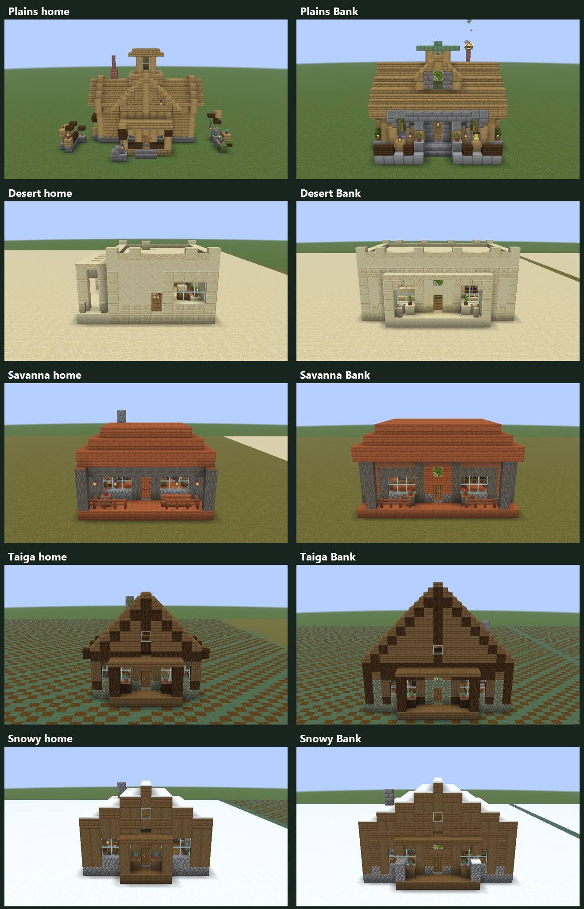
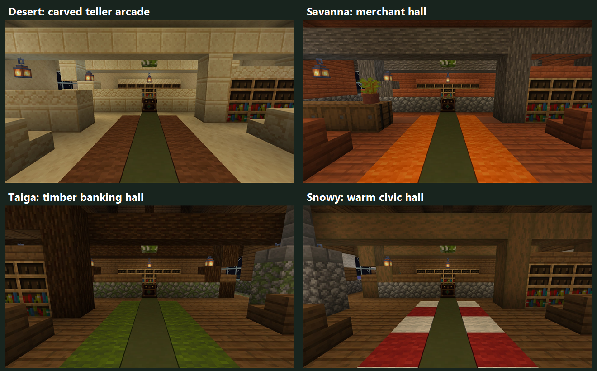
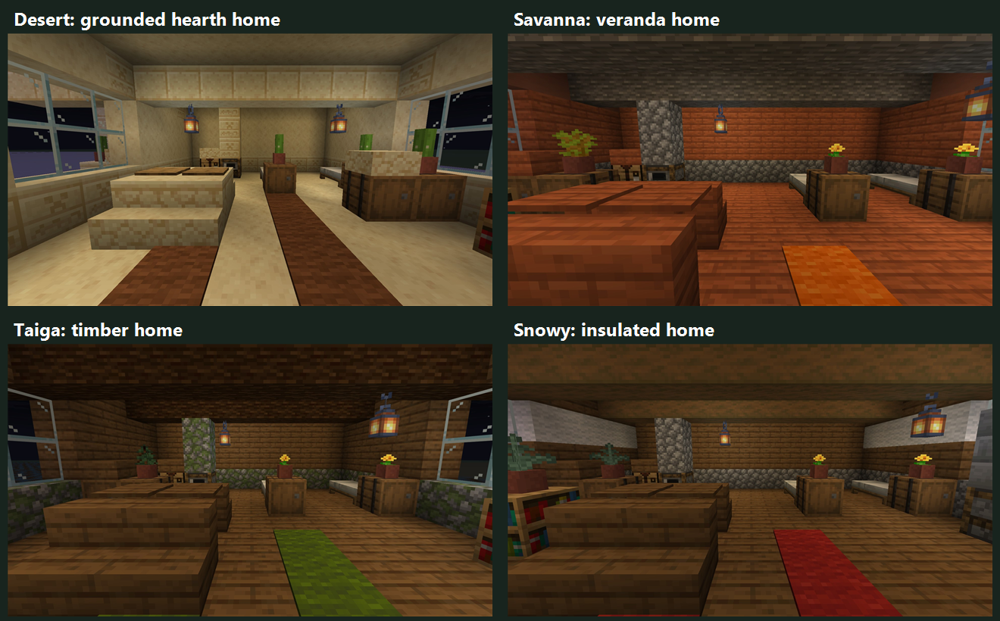

# Biome architecture preview — revision 3

Branch: `codex/biome-architecture-preview`. **Main and normal village generation are unchanged.**
This is a 13-sample art checkpoint, not a rollout of the production catalog.
[Revision 2](BIOME_ARCHITECTURE_PREVIEW_REVISION_2.md) remains available for comparison.

## What changed

Plains is unchanged from revision 2: the current native TES house, Bank and inn with an
oak-roof-only substitution. Its layout, furnishings, landscaping and physical bed counts
remain intact, verified against every original cell.

The four regional families now receive more deliberate construction and room detailing:

| Family | Exterior identity | Interior identity |
| --- | --- | --- |
| Desert | Pale sandstone, carved jambs/cornice, rhythmic parapet piers and shaded arcade | Framed record alcove, stone teller rail, grounded pedestal tables and bedside cabinets |
| Savanna | Gray acacia-log framing, restrained terracotta panels, shallow hip and veranda lattice | Merchant shelving, acacia trestle tables, planted cabinets and warm floor insets |
| Taiga | Mossy masonry, spruce shutters, exposed timber ties and steep gable | Stone-backed stove/flue, framed records and green textile accents |
| Snowy | Snow-bearing spruce roof, stripped-log framing and sheltered stone wind porch | Warm stove, reading alcove, pale insulating wall band and red/white textiles |

The Desert inn also gains a framed dining/lodging transition and reading alcove. The forge
keeps its open shaded work court, with carved banding and supported storage/work fixtures.
These are purposeful zones rather than filling the central aisle with decorative cubes.
Shared Bank service functions remain recognizable: public seating/writing area, teller rail,
exchange desk and reachable staff archive.







## Floating decoration corrections

Revision 2 had real gaps: top-slab bedside tables were half a block above the floor, and
raising some barrel caps to top slabs left a gap above the cabinet. A reversed Desert patio
counter range placed no counter at all beneath its pot.

Revision 3 uses full bedside cabinets, pots directly on barrel tops, correctly ordered patio
counter endpoints, and ground-based stone pedestals or wooden trestles with thin table tops.
A dedicated preview admission check rejects unsupported pots, table tops and low interior slabs,
including the hovering top-slab case and pots on cabinets that themselves lack a grounded base.
Negative tests deliberately reintroduce these failures.
This check is intentionally scoped to interior furnishings; roof beams, arches and canopies
are allowed to span between bearing members. It is not a universal structural-physics proof.

## Blueprint references

The supplied `minecraft_village_blueprints.zip` contains 181 reference images. I inspected
the Desert, Savanna, Taiga and Snowy-tundra Library 1 images directly. Their masonry bands,
bark framing, shuttered timber/stone façades and snow-covered spruce profiles informed the
regional details. These are original TES samples informed by those references, not exact
copies of the Wiki buildings. Reference files were read/extracted into ignored build
scratch space only, not republished. The archive README is reference data, not instructions
or an independently verified license statement.

## Full native views

All images below come from the real Fabric Minecraft client with default textures, no shaders
and collision-checked eye-level viewpoints. Interiors are captured at night to show actual
artificial lighting. Full frames are uncropped 1920×1080 JPEGs; labeled exterior contact sheets
crop only surrounding sky/ground. No decoration was painted out or added to a screenshot.

| # | Sample | Exterior | Inside | Reverse | Vanilla comparison |
| --- | --- | --- | --- | --- | --- |
| 1 | Existing Plains home, oak roof | [Exterior](previews/biome-architecture-2026-10-02-r3/001-mod.jpg) | [Inside](previews/biome-architecture-2026-10-02-r3/001-interior-entry.jpg) | [Reverse](previews/biome-architecture-2026-10-02-r3/001-interior-reverse.jpg) | [Pair](previews/biome-architecture-2026-10-02-r3/001-pair.jpg) |
| 2 | Existing Plains Bank, oak roof | [Exterior](previews/biome-architecture-2026-10-02-r3/002-mod.jpg) | [Inside](previews/biome-architecture-2026-10-02-r3/002-interior-entry.jpg) | [Reverse](previews/biome-architecture-2026-10-02-r3/002-interior-reverse.jpg) | [Pair](previews/biome-architecture-2026-10-02-r3/002-pair.jpg) |
| 3 | Existing Plains inn, oak roof | [Exterior](previews/biome-architecture-2026-10-02-r3/003-mod.jpg) | [Inside](previews/biome-architecture-2026-10-02-r3/003-interior-entry.jpg) | [Reverse](previews/biome-architecture-2026-10-02-r3/003-interior-reverse.jpg) | [Pair](previews/biome-architecture-2026-10-02-r3/003-pair.jpg) |
| 4 | Desert home | [Exterior](previews/biome-architecture-2026-10-02-r3/004-mod.jpg) | [Inside](previews/biome-architecture-2026-10-02-r3/004-interior-entry.jpg) | [Reverse](previews/biome-architecture-2026-10-02-r3/004-interior-reverse.jpg) | [Pair](previews/biome-architecture-2026-10-02-r3/004-pair.jpg) |
| 5 | Desert Bank | [Exterior](previews/biome-architecture-2026-10-02-r3/005-mod.jpg) | [Inside](previews/biome-architecture-2026-10-02-r3/005-interior-entry.jpg) | [Reverse](previews/biome-architecture-2026-10-02-r3/005-interior-reverse.jpg) | [Pair](previews/biome-architecture-2026-10-02-r3/005-pair.jpg) |
| 6 | Desert inn | [Exterior](previews/biome-architecture-2026-10-02-r3/006-mod.jpg) | [Inside](previews/biome-architecture-2026-10-02-r3/006-interior-entry.jpg) | [Reverse](previews/biome-architecture-2026-10-02-r3/006-interior-reverse.jpg) | [Pair](previews/biome-architecture-2026-10-02-r3/006-pair.jpg) |
| 7 | Desert smithy | [Exterior](previews/biome-architecture-2026-10-02-r3/007-mod.jpg) | [Inside](previews/biome-architecture-2026-10-02-r3/007-interior-entry.jpg) | [Reverse](previews/biome-architecture-2026-10-02-r3/007-interior-reverse.jpg) | [Pair](previews/biome-architecture-2026-10-02-r3/007-pair.jpg) |
| 8 | Savanna home | [Exterior](previews/biome-architecture-2026-10-02-r3/008-mod.jpg) | [Inside](previews/biome-architecture-2026-10-02-r3/008-interior-entry.jpg) | [Reverse](previews/biome-architecture-2026-10-02-r3/008-interior-reverse.jpg) | [Pair](previews/biome-architecture-2026-10-02-r3/008-pair.jpg) |
| 9 | Savanna Bank | [Exterior](previews/biome-architecture-2026-10-02-r3/009-mod.jpg) | [Inside](previews/biome-architecture-2026-10-02-r3/009-interior-entry.jpg) | [Reverse](previews/biome-architecture-2026-10-02-r3/009-interior-reverse.jpg) | [Pair](previews/biome-architecture-2026-10-02-r3/009-pair.jpg) |
| 10 | Taiga home | [Exterior](previews/biome-architecture-2026-10-02-r3/010-mod.jpg) | [Inside](previews/biome-architecture-2026-10-02-r3/010-interior-entry.jpg) | [Reverse](previews/biome-architecture-2026-10-02-r3/010-interior-reverse.jpg) | [Pair](previews/biome-architecture-2026-10-02-r3/010-pair.jpg) |
| 11 | Taiga Bank | [Exterior](previews/biome-architecture-2026-10-02-r3/011-mod.jpg) | [Inside](previews/biome-architecture-2026-10-02-r3/011-interior-entry.jpg) | [Reverse](previews/biome-architecture-2026-10-02-r3/011-interior-reverse.jpg) | [Pair](previews/biome-architecture-2026-10-02-r3/011-pair.jpg) |
| 12 | Snowy home | [Exterior](previews/biome-architecture-2026-10-02-r3/012-mod.jpg) | [Inside](previews/biome-architecture-2026-10-02-r3/012-interior-entry.jpg) | [Reverse](previews/biome-architecture-2026-10-02-r3/012-interior-reverse.jpg) | [Pair](previews/biome-architecture-2026-10-02-r3/012-pair.jpg) |
| 13 | Snowy Bank | [Exterior](previews/biome-architecture-2026-10-02-r3/013-mod.jpg) | [Inside](previews/biome-architecture-2026-10-02-r3/013-interior-entry.jpg) | [Reverse](previews/biome-architecture-2026-10-02-r3/013-interior-reverse.jpg) | [Pair](previews/biome-architecture-2026-10-02-r3/013-pair.jpg) |

Each pair uses an actual bundled Minecraft reference template. Banks and inns use the closest
vanilla analogue, not a nonexistent vanilla Bank. These curated test placements are not natural
world generation. [Capture evidence](previews/biome-architecture-2026-10-02-r3/capture-evidence.csv)
records source PNG/export JPEG checksums, actual camera coordinates and FOV for all 65 frames.

## Validation and boundaries

Validation: the final Fabric build passed all 13 preview admissions and production structure,
attachment and migration gates. The filtered NeoForge loader test passed with no failures.
The common regression suite (105 Java entrypoints, plus loader/version and wrapper checks)
and launcher/exporter syntax checks passed. The live
Fabric client placed all 13 pairs, validated final fragile attachments and camera clearance,
and completed all 65 frames. Native source hashes and every exported JPEG hash were verified.
Visual review of the exterior, Bank/home interior and Desert service-building sheets found
the original slab gaps corrected; the entrance pendants were also raised after a first capture
revealed their intrusive eye-level placement. Both scratch captures are retained locally.
The production catalog remains 52 revision-11 designs and Bank version 12. No costs, capacity,
immigration, saved building revisions or gameplay selection changed. Future rollout still needs
terrain, entrance, construction lifecycle, Banker access and migration integration tests.
No shader-pack match or NeoForge graphics capture is claimed.

Handbook accuracy review: long-form Building projects routing, reader projects/building_catalog
text and compact project/catalog pages continue to describe production correctly. These
developer-only art samples are not advertised as live gameplay. No recipes, registered content
or normal player-facing rules changed, so no unrelated handbook text was rewritten.

## Walk through revision 3

From the repository root, open the separate disposable profile:

```powershell
./scripts/open-village-comparison.ps1 -ArchitecturePreview -GameDirectory ./build/biome-preview-client-r3-02
```

Use `/emerald comparison visit 1` through `13`. The profile contains newly generated test chunks,
not copied player/chunk data. Old R1/R2 worlds and captures are retained, and current code refuses
their stale layout signatures instead of repainting them. No file was installed in a normal
Minecraft profile.

**Awaiting visual review. No full-catalog expansion or merge into main without approval.**
